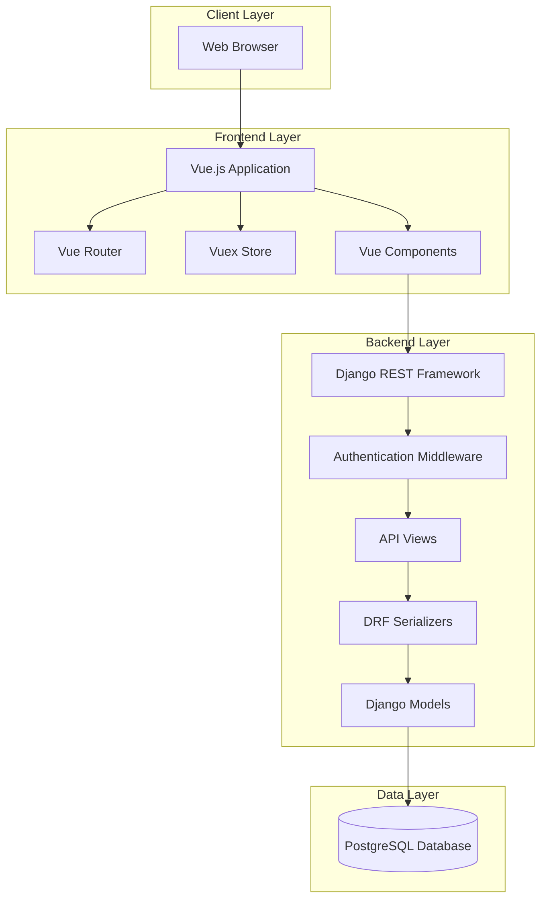
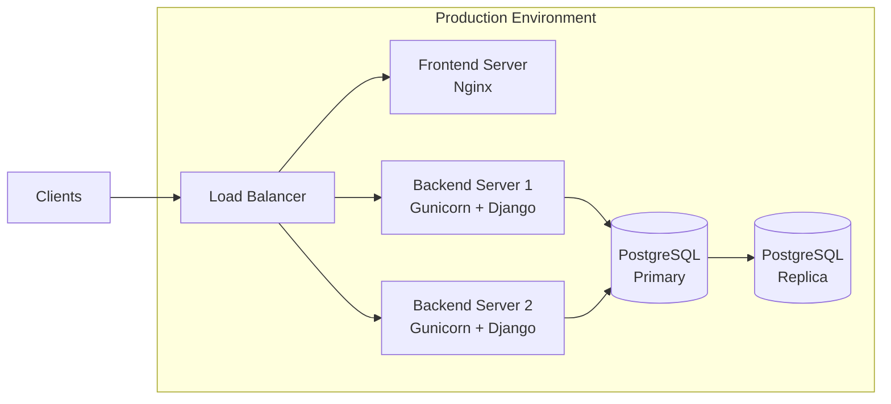
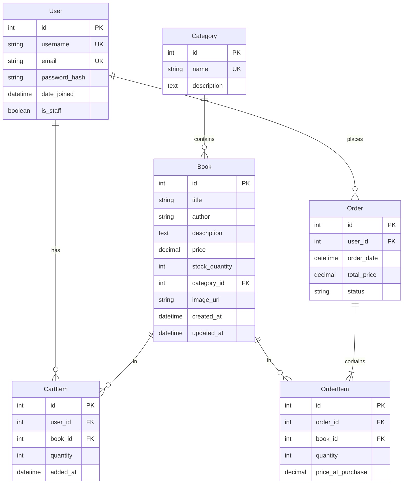

# Design Document: Fullstack Bookshop Ecommerce

## Overview

This design document specifies the technical architecture for a fullstack bookshop ecommerce platform. The system consists of three primary layers:

1. **Backend API**: Django REST Framework application providing RESTful endpoints for all business operations
2. **Database**: PostgreSQL relational database for persistent data storage
3. **Frontend Application**: Vue.js single-page application providing the customer interface

The architecture follows a clean separation of concerns with the backend handling all business logic, data validation, and persistence, while the frontend focuses on user experience and presentation. Communication between layers occurs through a well-defined REST API using JSON for data exchange.

Key design principles:
- RESTful API design with standard HTTP methods and status codes
- Token-based authentication for stateless session management
- Normalized database schema with referential integrity
- Component-based frontend architecture for reusability
- Comprehensive validation at both frontend and backend layers

## Architecture

### System Architecture



### Technology Stack

**Backend:**
- Python 3.10+
- Django 4.2+
- Django REST Framework 3.14+
- PostgreSQL 14+
- djangorestframework-simplejwt for JWT authentication

**Frontend:**
- Vue.js 3.x
- Vue Router 4.x for navigation
- Vuex 4.x or Pinia for state management
- Axios for HTTP requests
- Vite for build tooling

### Deployment Architecture



## Components and Interfaces

### Backend Components

#### 1. Authentication System

**Purpose**: Manages user registration, login, and token-based authentication.

**Implementation**:
- Uses Django's built-in User model extended with custom profile fields
- JWT tokens for stateless authentication
- Token refresh mechanism for extended sessions

**Key Classes**:
- `UserSerializer`: Handles user data serialization
- `RegisterView`: Endpoint for user registration
- `LoginView`: Endpoint for authentication
- `UserProfileView`: Endpoint for profile management
- `JWTAuthentication`: Middleware for token validation

**Endpoints**:
- `POST /api/auth/register/` - Create new user account
- `POST /api/auth/login/` - Authenticate and receive token
- `POST /api/auth/refresh/` - Refresh authentication token
- `GET /api/auth/profile/` - Get authenticated user profile
- `PUT /api/auth/profile/` - Update authenticated user profile
- `DELETE /api/auth/profile/` - Delete user account

#### 2. Book Management System

**Purpose**: Handles CRUD operations for books in the catalog.

**Implementation**:
- Django model with validation rules
- DRF ViewSet for standard REST operations
- Image URL validation
- Stock quantity tracking

**Key Classes**:
- `Book`: Django model representing a book
- `BookSerializer`: Serializes book data with validation
- `BookViewSet`: Provides CRUD endpoints

**Endpoints**:
- `GET /api/books/` - List all books
- `POST /api/books/` - Create new book (admin only)
- `GET /api/books/{id}/` - Retrieve specific book
- `PUT /api/books/{id}/` - Update book (admin only)
- `DELETE /api/books/{id}/` - Delete book (admin only)
- `GET /api/books/?category={id}` - Filter books by category

#### 3. Category Management System

**Purpose**: Organizes books into browsable categories.

**Implementation**:
- Simple Django model with name and description
- Relationship with Book model via foreign key

**Key Classes**:
- `Category`: Django model for book categories
- `CategorySerializer`: Serializes category data
- `CategoryViewSet`: Provides CRUD endpoints

**Endpoints**:
- `GET /api/categories/` - List all categories
- `POST /api/categories/` - Create new category (admin only)
- `GET /api/categories/{id}/` - Retrieve specific category
- `PUT /api/categories/{id}/` - Update category (admin only)
- `DELETE /api/categories/{id}/` - Delete category (admin only)
- `GET /api/categories/{id}/books/` - Get all books in category

#### 4. Shopping Cart System

**Purpose**: Manages temporary book selections before order placement.

**Implementation**:
- Cart items stored per user in database
- Quantity validation against available stock
- Automatic cart clearing after order placement

**Key Classes**:
- `CartItem`: Django model linking user, book, and quantity
- `CartItemSerializer`: Serializes cart item data
- `CartViewSet`: Provides cart management endpoints

**Endpoints**:
- `GET /api/cart/` - Get all items in user's cart
- `POST /api/cart/` - Add book to cart
- `PUT /api/cart/{id}/` - Update cart item quantity
- `DELETE /api/cart/{id}/` - Remove item from cart
- `DELETE /api/cart/clear/` - Clear entire cart

#### 5. Order Processing System

**Purpose**: Handles order creation, stock management, and order history.

**Implementation**:
- Transactional order creation to ensure data consistency
- Stock reduction during order placement
- Order history tracking per user
- Admin access to all orders

**Key Classes**:
- `Order`: Django model for order header
- `OrderItem`: Django model for individual order line items
- `OrderSerializer`: Serializes order data with nested items
- `OrderViewSet`: Provides order management endpoints

**Endpoints**:
- `POST /api/orders/` - Create order from cart
- `GET /api/orders/` - List user's orders (or all orders for admin)
- `GET /api/orders/{id}/` - Retrieve specific order

### Frontend Components

#### 1. Authentication Components

**LoginForm.vue**
- Purpose: User login interface
- Props: None
- Emits: `login-success`
- State: username, password, error message
- Methods: `handleLogin()`, `validateForm()`

**RegisterForm.vue**
- Purpose: New user registration interface
- Props: None
- Emits: `register-success`
- State: username, email, password, confirmPassword, error message
- Methods: `handleRegister()`, `validateForm()`

**UserProfile.vue**
- Purpose: Display and edit user profile
- Props: None
- State: user data, editing mode
- Methods: `loadProfile()`, `updateProfile()`, `deleteAccount()`

#### 2. Book Display Components

**BookList.vue**
- Purpose: Display grid of books with filtering
- Props: `categoryId` (optional)
- State: books array, loading state, selected category
- Methods: `fetchBooks()`, `filterByCategory()`, `addToCart()`

**BookCard.vue**
- Purpose: Individual book display card
- Props: `book` object
- Emits: `add-to-cart`
- Methods: `showDetails()`, `handleAddToCart()`

**BookDetail.vue**
- Purpose: Detailed view of single book
- Props: `bookId`
- State: book object, loading state
- Methods: `fetchBookDetails()`, `addToCart()`

#### 3. Category Components

**CategoryFilter.vue**
- Purpose: Category selection interface
- Props: None
- State: categories array, selected category
- Methods: `fetchCategories()`, `selectCategory()`
- Emits: `category-selected`

#### 4. Shopping Cart Components

**CartIcon.vue**
- Purpose: Display cart item count in header
- Props: None
- Computed: `itemCount` from store
- Methods: `navigateToCart()`

**CartView.vue**
- Purpose: Full cart display and management
- Props: None
- State: cart items, total price
- Methods: `fetchCart()`, `updateQuantity()`, `removeItem()`, `clearCart()`, `checkout()`

**CartItem.vue**
- Purpose: Individual cart item display
- Props: `item` object
- Emits: `update-quantity`, `remove-item`
- Methods: `incrementQuantity()`, `decrementQuantity()`

#### 5. Order Components

**OrderConfirmation.vue**
- Purpose: Display order success message
- Props: `orderId`
- State: order details
- Methods: `fetchOrderDetails()`

**OrderHistory.vue**
- Purpose: List all user orders
- Props: None
- State: orders array, loading state
- Methods: `fetchOrders()`

**OrderDetail.vue**
- Purpose: Detailed view of single order
- Props: `orderId`
- State: order object with items
- Methods: `fetchOrderDetails()`

#### 6. Layout Components

**AppHeader.vue**
- Purpose: Main navigation and user menu
- Props: None
- Computed: `isAuthenticated`, `username`
- Methods: `logout()`

**AppFooter.vue**
- Purpose: Footer with links and information
- Props: None

### API Communication Layer

**api/client.js**
- Axios instance with base URL configuration
- Request interceptor to add authentication token
- Response interceptor for error handling

**api/auth.js**
- `register(userData)`: Register new user
- `login(credentials)`: Authenticate user
- `getProfile()`: Fetch user profile
- `updateProfile(userData)`: Update user profile
- `deleteAccount()`: Delete user account

**api/books.js**
- `getBooks(categoryId)`: Fetch books list
- `getBook(id)`: Fetch single book
- `createBook(bookData)`: Create book (admin)
- `updateBook(id, bookData)`: Update book (admin)
- `deleteBook(id)`: Delete book (admin)

**api/categories.js**
- `getCategories()`: Fetch all categories
- `getCategory(id)`: Fetch single category
- `getCategoryBooks(id)`: Fetch books in category

**api/cart.js**
- `getCart()`: Fetch cart items
- `addToCart(bookId, quantity)`: Add item to cart
- `updateCartItem(itemId, quantity)`: Update quantity
- `removeCartItem(itemId)`: Remove item
- `clearCart()`: Clear all items

**api/orders.js**
- `createOrder()`: Create order from cart
- `getOrders()`: Fetch user's orders
- `getOrder(id)`: Fetch single order

### State Management

**Vuex Store Structure**:

```javascript
{
  auth: {
    user: null,
    token: null,
    isAuthenticated: false
  },
  books: {
    items: [],
    currentBook: null,
    loading: false
  },
  categories: {
    items: [],
    selectedCategory: null
  },
  cart: {
    items: [],
    itemCount: 0,
    totalPrice: 0
  },
  orders: {
    items: [],
    currentOrder: null
  }
}
```

**Store Modules**:
- `auth.js`: Authentication state and actions
- `books.js`: Book catalog state and actions
- `categories.js`: Category state and actions
- `cart.js`: Shopping cart state and actions
- `orders.js`: Order history state and actions

## Data Models

### Database Schema



### Django Models

#### User Model
```python
# Uses Django's built-in User model (django.contrib.auth.models.User)
# Fields: id, username, email, password, date_joined, is_staff, is_active
```

#### Category Model
```python
class Category(models.Model):
    id = models.AutoField(primary_key=True)
    name = models.CharField(max_length=100, unique=True)
    description = models.TextField(blank=True)
    
    class Meta:
        verbose_name_plural = "categories"
        ordering = ['name']
```

#### Book Model
```python
class Book(models.Model):
    id = models.AutoField(primary_key=True)
    title = models.CharField(max_length=200)
    author = models.CharField(max_length=200)
    description = models.TextField()
    price = models.DecimalField(max_digits=10, decimal_places=2)
    stock_quantity = models.IntegerField(default=0)
    category = models.ForeignKey(Category, on_delete=models.SET_NULL, null=True, related_name='books')
    image_url = models.URLField(max_length=500)
    created_at = models.DateTimeField(auto_now_add=True)
    updated_at = models.DateTimeField(auto_now=True)
    
    class Meta:
        ordering = ['-created_at']
    
    def clean(self):
        if self.price <= 0:
            raise ValidationError("Price must be positive")
        if self.stock_quantity < 0:
            raise ValidationError("Stock quantity cannot be negative")
```

#### CartItem Model
```python
class CartItem(models.Model):
    id = models.AutoField(primary_key=True)
    user = models.ForeignKey(User, on_delete=models.CASCADE, related_name='cart_items')
    book = models.ForeignKey(Book, on_delete=models.CASCADE)
    quantity = models.IntegerField(default=1)
    added_at = models.DateTimeField(auto_now_add=True)
    
    class Meta:
        unique_together = ['user', 'book']
        ordering = ['-added_at']
    
    def clean(self):
        if self.quantity > self.book.stock_quantity:
            raise ValidationError("Requested quantity exceeds available stock")
        if self.quantity <= 0:
            raise ValidationError("Quantity must be positive")
```

#### Order Model
```python
class Order(models.Model):
    STATUS_CHOICES = [
        ('pending', 'Pending'),
        ('confirmed', 'Confirmed'),
        ('shipped', 'Shipped'),
        ('delivered', 'Delivered'),
        ('cancelled', 'Cancelled'),
    ]
    
    id = models.AutoField(primary_key=True)
    user = models.ForeignKey(User, on_delete=models.CASCADE, related_name='orders')
    order_date = models.DateTimeField(auto_now_add=True)
    total_price = models.DecimalField(max_digits=10, decimal_places=2)
    status = models.CharField(max_length=20, choices=STATUS_CHOICES, default='pending')
    
    class Meta:
        ordering = ['-order_date']
```

#### OrderItem Model
```python
class OrderItem(models.Model):
    id = models.AutoField(primary_key=True)
    order = models.ForeignKey(Order, on_delete=models.CASCADE, related_name='items')
    book = models.ForeignKey(Book, on_delete=models.PROTECT)
    quantity = models.IntegerField()
    price_at_purchase = models.DecimalField(max_digits=10, decimal_places=2)
    
    class Meta:
        ordering = ['id']
```

### Data Validation Rules

**Book Validation**:
- `title`: Required, max 200 characters
- `author`: Required, max 200 characters
- `description`: Required, text field
- `price`: Required, positive decimal with 2 decimal places
- `stock_quantity`: Required, non-negative integer
- `category`: Optional foreign key
- `image_url`: Required, valid URL format, max 500 characters

**Category Validation**:
- `name`: Required, unique, max 100 characters
- `description`: Optional, text field

**User Validation**:
- `username`: Required, unique, 3-150 characters
- `email`: Required, unique, valid email format
- `password`: Required, minimum 8 characters (enforced at registration)

**CartItem Validation**:
- `quantity`: Required, positive integer
- `quantity`: Must not exceed book's stock_quantity
- Unique constraint on (user, book) combination

**Order Validation**:
- `total_price`: Calculated from order items, positive decimal
- `status`: Must be one of defined choices

**OrderItem Validation**:
- `quantity`: Required, positive integer
- `price_at_purchase`: Required, positive decimal (captured at order time)

### Cascade Rules

- **Category deletion**: Books with deleted category have `category` set to NULL (`SET_NULL`)
- **User deletion**: All user's cart items and orders are deleted (`CASCADE`)
- **Book deletion from cart**: Cart item is deleted (`CASCADE`)
- **Book deletion from order**: Prevented to maintain order history (`PROTECT`)
- **Order deletion**: All order items are deleted (`CASCADE`)

